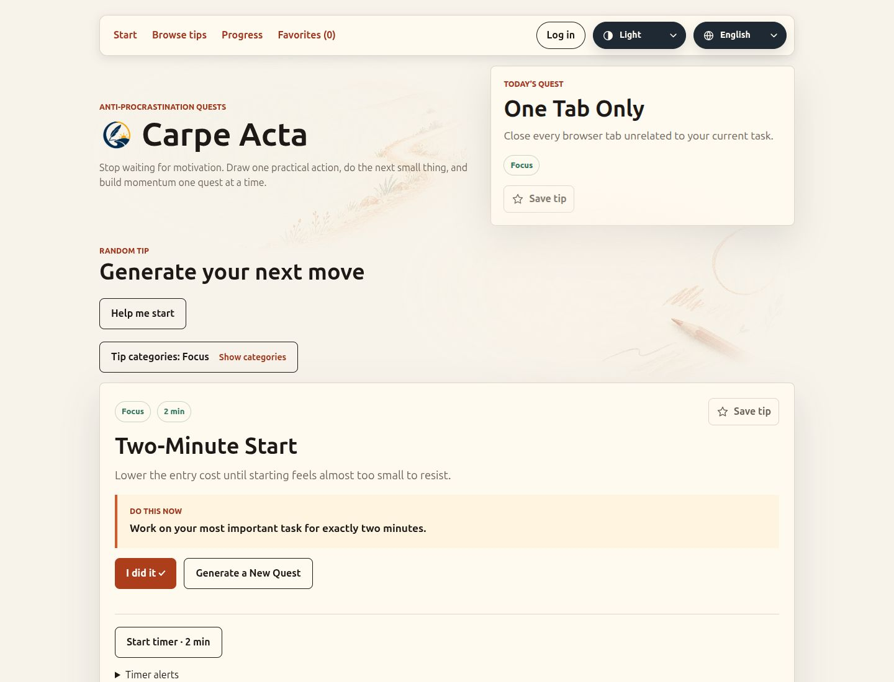
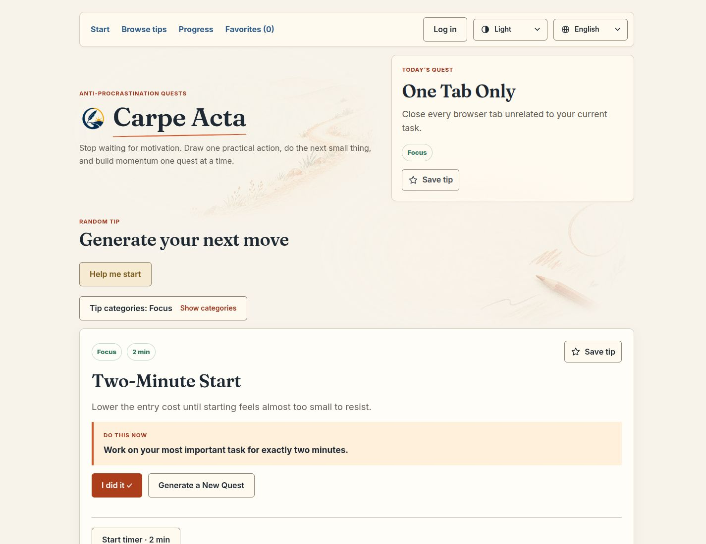

# Phase 1 — Living Notebook foundations

Ready for review, 10 October 2026. “The Living Notebook” describes the visual direction; the product remains Carpe Acta.

Branch: `codex/living-notebook-foundations`. Baseline: `e2c147e` (the committed Phase 0 preview). The working tree was clean when this phase began. Phase 0 source, assets, screenshots and documentation are unchanged. Changes for this phase are local and uncommitted; nothing was deployed.

## Review locally

Run `npm run dev -- --host 127.0.0.1` and open the address Vite prints. The session's running application is at **http://127.0.0.1:5174/**. The original three-way comparison remains at **http://127.0.0.1:5174/__design** in development only.

The production app now opts into a scoped foundation stylesheet through `data-design="notebook"` on the document root. The preview does not opt in. This keeps the original comparison available without copying the app or changing its feature components.

## What changed

- **Typography:** locally hosted Fraunces 600 for expressive headings and branding; variable Inter for body text, long instructions, labels, controls and numeric UI. Fallbacks remain Georgia/serif and Inter/system sans-serif. Heading line-height is 1.18; body line-height is 1.6. Neither brand text nor emblem changed.
- **Paper surfaces:** cream page, warm paper information panels, a subtly raised current-action surface, and distinct floating panels/dialogs. Heavy shared shadows are replaced by restrained elevation. A small imperfect underline beneath the existing brand is the only new decorative mark. Existing illustrations remain in place.
- **Controls:** consistent 6px corners, clear primary/secondary treatments, legible borders, calm hover/pressed states, and shared minimum target heights of 44px. The calendar's compact cells retain their existing behavior and geometry. The floating back-to-top control now also has a 44px minimum.
- **Colour roles:** terracotta for actions; sage for existing progress states; blue for discovery/navigation and focus; warm ochre for support. Category selection remains explicit, using its existing pressed state. No new category colours, icon pack or metrics were introduced.
- **Accessibility:** consistent visible focus, a lighter focus colour for the dark footer, keyboard-visible preference options, readable active states and no movement of interactive hit areas on hover. Reduced-motion users receive no CSS transitions/animations. Existing keyboard semantics and focus handling are unchanged.

The Tip Card, generator and timer inherit shared typography/surface/control values, but their structure, ordering, content, selection and timer behavior were not redesigned. That work is reserved for a separately approved Phase 2.

## Foundation vocabulary

Defined in `src/styles/foundations.css`:

| Tokens | Purpose |
| --- | --- |
| `--surface-page`, `--surface-paper`, `--surface-raised`, `--surface-overlay` | Page, information, current focus and floating UI |
| `--ink`, `--ink-muted`, `--rule`, `--control-border` | Text, subtle separators and readable control boundaries |
| `--action`, `--action-hover`, `--action-pressed`, `--action-ink`, `--action-tint` | Terracotta action states |
| `--progress-ink`, `--discovery-ink`, `--support-ink`, `--support-tint` | Restrained semantic roles |
| `--focus-ring`, `--focus-inverse` | Focus on light/paper surfaces and dark inverse surfaces |
| `--space-1/2/3/4/5/6/8/12` | 4, 8, 12, 16, 20, 24, 32 and 48px spacing scale |
| `--radius-control/card/overlay/pill` | 6, 10, 14 and 999px geometry |
| `--elevation-0/1/2/3` | Flat, ordinary information, current focus and floating UI |
| `--font-body/display`, `--leading-body/heading` | Typography roles |
| `--target-min`, `--motion-fast` | 44px control target and 160ms colour feedback |

Existing variable names such as `--surface`, `--primary` and `--muted` are compatibility aliases to these roles. Existing `src/styles.css` continues to own component layouts and breakpoints. The scoped foundation layer overrides shared presentation only; future component work should consume these tokens instead of introducing another palette or overriding them per screen.

## Files and preservation

- `src/main.tsx`: adds the foundation import and the production-app styling marker (two lines).
- `src/styles/foundations.css`: tokens, theme adaptations and shared visual treatments.
- `src/styles/fonts.css`: local font-face declarations with Latin/Latin Extended ranges and `font-display: swap`.
- `src/assets/fonts/`: promoted copies of the reviewed Phase 0 WOFF2 files plus their SIL Open Font Licenses. The original preview files remain untouched.
- `tests/foundations-contrast.test.ts`: contrast coverage for both themes, primary hover/pressed states, support colours, control borders and focus roles.

No changes to `App.tsx`, feature components, hooks, catalog, localization keys, account integration, data models, persistence, package manifest or lockfile. No new dependency, migration or deployment.

## Before and after

The baseline screenshots were captured from an isolated temporary copy of commit `e2c147e`, then its local server was stopped. This allowed the final comparison to use the same current date and real Daily Quest after the work crossed midnight. Both versions show **Two-Minute Start** selected through the real library, **One Tab Only** as the Daily Quest, empty local progress, and no active timer. No production selection/date logic was changed to stage the comparison.

Desktop viewport: 1440 × 1100; mobile: 390 × 844. Full-page captures omit the browser's scrollbar, producing 1425px/375px content widths. Additional layout checks used 320px and 768px.

| State | Before | After |
| --- | --- | --- |
| Desktop, English, light | [Before](screenshots/before-desktop-en-light.jpg) | [After](screenshots/after-desktop-en-light.jpg) |
| Desktop, English, dark | [Before](screenshots/before-desktop-en-dark.jpg) | [After](screenshots/after-desktop-en-dark.jpg) |
| Mobile, Serbian, light | [Before](screenshots/before-mobile-sr-light.jpg) | [After](screenshots/after-mobile-sr-light.jpg) |
| Mobile, Serbian, dark | [Before](screenshots/before-mobile-sr-dark.jpg) | [After](screenshots/after-mobile-sr-dark.jpg) |

Additional captures: [desktop dialog](screenshots/after-dialog-dark.jpg), [320px Serbian dialog with keyboard focus](screenshots/after-mobile-dialog-focus.jpg).

| Desktop detail before | Desktop detail after |
| --- | --- |
|  |  |

## Verification

- Baseline: **338 tests passed in 40 files**, production build passed.
- Phase 1: **340 tests passed in 41 files**. The contrast tests were rerun after the final focus refinements and passed.
- Final TypeScript/Vite production build passed; `git diff --check` passed.
- The existing >500kB JavaScript bundle warning remains. Main JS is approximately 640.72kB versus 640.66kB baseline. CSS is 39.61kB (8.67kB gzip), versus 29.00kB (6.72kB gzip).
- Local font files total **168,756 bytes** (about 165KiB); English-only text can use the smaller Latin subsets. Both families include `Čč Ćć Žž Šš Đđ`, verified from actual glyph coverage with `fc-scan`. Rendered styles confirmed Fraunces headings and Inter instructions.
- Browser checks covered English and Serbian, both themes, 1440px desktop, 768px tablet, 390px mobile and 320px narrow mobile. Expanded Serbian categories/library filters had no page overflow. The existing calendar keeps its own horizontal scrolling when needed.
- Keyboard checks covered preference menus (Enter/arrows), visible option focus, dialog focus and Escape dismissal. The narrow Serbian dialog remained within the viewport. No login was submitted and no completion/favourite data was created.
- No console warnings/errors were observed in the application tab during the checks.
- Phase 0 verified in-browser: no foundation opt-in, original `Preview Fraunces`/`Preview Inter` families, original 5px Notebook card radius and working variant switching. Its source files are unchanged. Preview code/selectors remain absent from production output.

## Remaining risks and boundaries

This is a foundation pass. Font metrics and shared line-height change wrapping and page height, particularly in Serbian; long content should continue to be checked as each later component is redesigned. Local fonts add a first-visit download, though they use swap/fallbacks and require no third-party font request.

The contrast tests validate defined colour pairs, not every composited illustration pixel. The browser verification used Chromium, not a complete cross-browser/device matrix. Reduced-motion and forced-colour rules were reviewed in CSS, but their OS modes were not emulated here. A full screen-reader audit and authenticated account-state visual review were not performed.

The source still contains existing component-specific sizes/radii in `src/styles.css`; the new shared tokens are the foundation for gradually migrating those rules as their components receive an approved redesign. No broad stylesheet rewrite was attempted.

**Stopped after Phase 1. Phase 2 has not started.**
